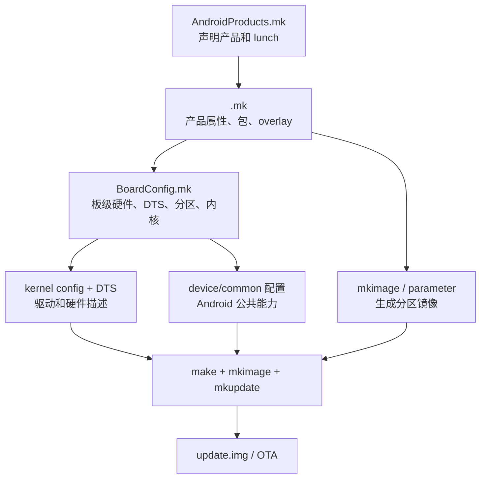

# 🧩 基于 RK3576 新增产品配置实施流程

> [!info] 目标
> 基于现有 RK3576 产品复制一个新产品，完成客户配置、设备树、Product 配置和基础镜像编译。
>
> 本文以复制 `rk3576_u` 为例，新增产品名假设为 `rk3576_demo`。
> 实际项目中应把 `rk3576_demo` 替换成正式、唯一、符合命名规范的产品名。

---

## 一、先理解新增产品涉及哪些层



新增产品不是只复制一个 `.mk` 文件，而是至少要统一以下对象：

| 层级 | 主要文件 | 负责内容 |
|:---|:---|:---|
| 产品注册 | `AndroidProducts.mk` | `lunch` 名称、产品 makefile |
| 产品配置 | `<product>.mk` | 产品名、品牌、属性、包、overlay、拷贝文件 |
| 板级配置 | `BoardConfig.mk` | DTS、Kernel/U-Boot 配置、AB、AVB、分区、硬件开关 |
| 设备树 | kernel DTS/DTSI | GPIO、I2C、屏、触摸、摄像头、供电、存储 |
| Kernel 配置 | `arch/arm64/configs/*.config` | 驱动是否编译、模块类型、功能开关 |
| 资源和策略 | `overlay/`、`sepolicy/`、rc/xml | UI 覆盖、SELinux、启动服务、媒体能力 |
| 镜像输入 | `customer.img`、`config.cfg`、parameter | 客户分区和烧录/打包输入 |

> [!tip] 先记住这张“修改位置”地图
> 假设新增产品名为 `rk3576_demo`，实际需要修改的位置如下。文档后续每一步都会再次说明。
>
> ```text
> Android 产品目录：
> /home/ssd12/huangziye/Android/android/device/rockchip/rk3576/rk3576_demo/
>
> 产品注册：
> device/rockchip/rk3576/rk3576_demo/AndroidProducts.mk
>
> 产品属性：
> device/rockchip/rk3576/rk3576_demo/rk3576_demo.mk
>
> 板级配置：
> device/rockchip/rk3576/rk3576_demo/BoardConfig.mk
>
> 设备树：
> kernel-6.1/arch/arm64/boot/dts/rockchip/rk3576-demo-v10.dts
>
> 设备树编译入口：
> kernel-6.1/arch/arm64/boot/dts/rockchip/Makefile
>
> Kernel 配置片段：
> kernel-6.1/arch/arm64/configs/rk3576_demo.config
>
> 客户资源和策略：
> device/rockchip/rk3576/rk3576_demo/overlay/
> device/rockchip/rk3576/rk3576_demo/sepolicy/
> device/rockchip/rk3576/rk3576_demo/customer/customer.img
>
> 公共芯片配置（一般不要直接改）：
> device/rockchip/rk3576/BoardConfig.mk
>
> 镜像整理脚本（一般不要为新增产品修改）：
> device/rockchip/common/mkimage.sh
> device/rockchip/common/mkimage_ab.sh
> ```
>
> [!warning] 修改优先级
> > 先改新产品目录内的文件；只有确认是所有 RK3576 产品共有的问题，才考虑修改父级 `device/rockchip/rk3576/BoardConfig.mk` 或公共脚本。不要为了让一个新产品能编译而直接改公共配置。

---

# 二、推荐的实施策略

## 推荐原则：先复制，再最小修改，最后逐项替换

不要一开始就同时改 DTS、Kernel、分区、产品包和 AVB。建议分三阶段：

### 阶段 A：复制一个已知可编译产品

目标：先证明新产品注册、环境和基础 Android 配置没有问题。

### 阶段 B：替换板级差异

目标：修改 DTS、内核配置、屏幕、触摸、传感器、Wi-Fi 等硬件。

### 阶段 C：替换客户差异

目标：修改品牌、预装应用、overlay、权限、customer 分区和量产安全策略。

> [!tip] 为什么这样拆
> 如果一次修改十几个维度，最终出错时无法判断是产品配置、DTS、驱动、分区还是打包问题。

---

# 三、完整操作流程

## Step 0：建立基线并确认原产品能编译

先不要复制一个本身就有问题的产品。

```bash
cd ~/Android/android
source build/envsetup.sh
lunch rk3576_u-userdebug

get_build_var TARGET_PRODUCT
get_build_var BOARD_USES_AB_IMAGE
get_build_var BOARD_AVB_ENABLE
get_build_var BOARD_BUILD_GKI
get_build_var PRODUCT_KERNEL_DTS
get_build_var PRODUCT_UBOOT_CONFIG
```

记录基线：

```bash
mkdir -p ~/build-baseline/rk3576_u
cp device/rockchip/rk3576/rk3576_u/BoardConfig.mk ~/build-baseline/rk3576_u/
cp device/rockchip/rk3576/rk3576_u/rk3576_u.mk ~/build-baseline/rk3576_u/
cp device/rockchip/rk3576/rk3576_u/AndroidProducts.mk ~/build-baseline/rk3576_u/
```

> [!danger] 不要跳过基线
> 如果原产品不能独立编译，新产品复制后出现的问题无法归因。复制产品前必须先证明源产品能生成至少 `boot.img`、`super.img` 和 `update.img`。

---

## Step 1：复制产品目录

以 `rk3576_u` 为模板：

```bash
cd ~/Android/android/device/rockchip/rk3576
cp -a rk3576_u rk3576_demo
```

新目录建议保留必要结构：

```text
rk3576_demo/
├── AndroidProducts.mk
├── BoardConfig.mk
├── rk3576_demo.mk
├── Android.mk
├── AndroidBoard.mk
├── dt-overlay.in
├── config.cfg
├── config.cfg_ab
├── config.cfg_ab_gki
├── init.cviauto.rc
├── media_profiles_default.xml
├── sepolicy/
├── overlay/
├── touchscreen/
├── devmem/
├── customer/
└── ota/
```

> [!warning] 不要机械保留所有文件
> `himax_mmi.ko`、`mymem.ko`、`init.cviauto.rc`、传感器配置可能是旧板专用。复制后要逐个确认，不要因为“能编译”就认为“适合新板”。

---

## Step 2：修改 `AndroidProducts.mk`

文件：

`device/rockchip/rk3576/rk3576_demo/AndroidProducts.mk`

```makefile
PRODUCT_MAKEFILES := \
    $(LOCAL_DIR)/rk3576_demo.mk

COMMON_LUNCH_CHOICES := \
    rk3576_demo-userdebug \
    rk3576_demo-user
```

检查项：

- `PRODUCT_MAKEFILES` 指向新文件；
- `COMMON_LUNCH_CHOICES` 使用新产品名；
- 不要继续注册成 `rk3576_u`；
- 产品名只使用字母、数字、下划线，避免空格和特殊字符。

刷新环境并检查：

```bash
source build/envsetup.sh
lunch rk3576_demo-userdebug
```

如果 lunch 菜单没有新产品，优先检查 `AndroidProducts.mk` 的路径和变量名。

---

## Step 3：修改产品级 `<product>.mk`

文件：

`device/rockchip/rk3576/rk3576_demo/rk3576_demo.mk`

最少需要修改：

```makefile
include device/rockchip/rk3576/rk3576_demo/BoardConfig.mk

PRODUCT_NAME := rk3576_demo
PRODUCT_DEVICE := rk3576_demo
PRODUCT_BRAND := my_company
PRODUCT_MODEL := My RK3576 Device
PRODUCT_MANUFACTURER := my_company
```

同时检查所有旧名称：

```bash
grep -Rnw device/rockchip/rk3576/rk3576_demo \
    -e 'rk3576_u' -e 'rk3576-vehicle-evb-v20'
```

需要按新产品实际情况修改的项目：

```makefile
PRODUCT_CHARACTERISTICS := tablet
PRODUCT_AAPT_PREF_CONFIG := mdpi
PRODUCT_PROPERTY_OVERRIDES += ro.sf.lcd_density=320
DEVICE_PACKAGE_OVERLAYS += $(LOCAL_PATH)/overlay
```

### `PRODUCT_COPY_FILES` 要逐项确认

模板中可能有：

```makefile
PRODUCT_COPY_FILES += \
    $(LOCAL_PATH)/init.cviauto.rc:$(TARGET_COPY_OUT_VENDOR)/etc/init/hw/init.cviauto.rc

PRODUCT_COPY_FILES += \
    $(LOCAL_PATH)/touchscreen/himax_mmi.ko:$(TARGET_COPY_OUT_VENDOR)/etc/modules/himax_mmi.ko \
    $(LOCAL_PATH)/devmem/mymem.ko:$(TARGET_COPY_OUT_VENDOR)/etc/modules/mymem.ko
```

如果新板不是 Himax 触摸，必须删除或替换 `himax_mmi.ko`；否则可能出现：

- 镜像能编译，但开机加载错误模块；
- vendor 模块加载失败；
- 触摸设备不存在；
- 驱动版本与 kernel ABI 不匹配。

---

## Step 4：修改板级 `BoardConfig.mk`

文件：

`device/rockchip/rk3576/rk3576_demo/BoardConfig.mk`

建议先复制出一个最小可编译版本：

```makefile
BUILD_WITH_GO_OPT := false
BOARD_BUILD_GKI := false

# 根据产品实际选择
BOARD_USES_AB_IMAGE := true
# BOARD_AVB_ENABLE := false

PRODUCT_KERNEL_DTS := rk3576-demo-v10
PRODUCT_KERNEL_CONFIG += pcie_wifi.config
PRODUCT_KERNEL_CONFIG += rk3576.config

ifeq ($(BOARD_USES_AB_IMAGE),true)
PRODUCT_UBOOT_CONFIG ?= rk3576_defconfig rk3576-ab-car.config
else
PRODUCT_UBOOT_CONFIG ?= rk3576_defconfig rk3576-car.config
endif

BOARD_CAMERA_SUPPORT_EXT := true
BOARD_SEPOLICY_DIRS += $(TARGET_DEVICE_DIR)/sepolicy

include device/rockchip/rk3576/BoardConfig.mk

TARGET_CUSTOMER_IMAGE ?= device/rockchip/rk3576/rk3576_demo/customer/customer.img
BOARD_WITH_CUSTOMER_PARTITIONS := customer:64M
```

### 关键变量不要凭模板复制

| 变量 | 必须根据什么确定 |
|:---|:---|
| `PRODUCT_KERNEL_DTS` | 新板真实 DTS 文件名 |
| `PRODUCT_KERNEL_CONFIG` | 实际使用的驱动和功能 |
| `PRODUCT_UBOOT_CONFIG` | AB/非 AB 和启动介质 |
| `BOARD_USES_AB_IMAGE` | OTA 和分区设计要求 |
| `BOARD_AVB_ENABLE` | 是否有正式 AVB 密钥和锁定启动链 |
| `BOARD_BUILD_GKI` | 内核模块架构和 GKI 方案 |
| `BOARD_WITH_CUSTOMER_PARTITIONS` | 分区表和容量规划 |
| `TARGET_CUSTOMER_IMAGE` | 客户镜像真实路径 |

> [!danger] AB/AVB/GKI 不能靠猜
> `BOARD_USES_AB_IMAGE`、`BOARD_AVB_ENABLE`、`BOARD_BUILD_GKI` 是三个独立开关。新增产品时必须明确写出最终状态，避免继承旧产品的隐式值。

---

## Step 5：确认设备树 DTS

### 5.1 先找现有 DTS

```bash
cd ~/Android/android/kernel-6.1
find arch/arm64/boot/dts/rockchip -type f \
    \( -name '*rk3576*' -o -name '*tablet*' -o -name '*vehicle*' \)
```

查看模板 DTS：

```bash
grep -nE 'model|compatible|panel|touch|backlight|gpio|i2c|spi|regulator' \
    arch/arm64/boot/dts/rockchip/rk3576-vehicle-evb-v20.dts
```

### 5.2 复制还是复用？

#### 硬件完全相同

可以直接复用已有 DTS：

```makefile
PRODUCT_KERNEL_DTS := rk3576-vehicle-evb-v20
```

这适合先验证产品注册和 Android 基础配置。

#### 硬件有差异

复制 DTS：

```bash
cp arch/arm64/boot/dts/rockchip/rk3576-vehicle-evb-v20.dts \
   arch/arm64/boot/dts/rockchip/rk3576-demo-v10.dts
```

修改：

```dts
/dts-v1/;

#include "rk3576-xxx.dtsi"

/ {
    model = "My RK3576 Demo Board";
    compatible = "my-company,rk3576-demo", "rockchip,rk3576";
};
```

然后加入对应 DTS Makefile：

```makefile
dtb-$(CONFIG_ARCH_ROCKCHIP) += rk3576-demo-v10.dtb
```

> [!warning] DTS 文件名必须贯通
> `PRODUCT_KERNEL_DTS`、DTS 文件名、Makefile 中的 `.dtb`、`make <DTS>.img` 目标必须一致。文件名不一致通常会导致：
>
> ```text
> No rule to make target '<dts>.img'
> ```

### 5.3 DTS 修改顺序

建议按以下顺序改：

1. `/ { model / compatible }`；
2. `chosen`、内存和 reserved-memory；
3. 存储和 PMIC；
4. 电源 regulator；
5. 显示、背光和触摸；
6. Wi-Fi/BT；
7. 摄像头；
8. GPIO keys、LED、传感器；
9. 禁用新板不存在的设备节点。

不要一开始把所有节点都打开。节点打开但硬件不存在，会产生 probe error、启动延迟、功耗异常甚至死机。

---

## Step 6：配置 Kernel 驱动

### 6.1 先确认驱动和 DTS 配套

```bash
grep -Rnw kernel-6.1/drivers/input/touchscreen \
    -e 'CONFIG_TOUCHSCREEN' | head

grep -Rnw kernel-6.1/arch/arm64/configs \
    -e 'TOUCHSCREEN' -e 'WLAN' -e 'CAMERA'
```

硬件适配需要同时满足：

```text
DTS 节点存在
    +
Kernel CONFIG 打开
    +
驱动代码/模块存在
    +
GPIO/I2C/SPI/电源配置正确
```

### 6.2 使用 config fragment

不要直接手改生成后的 `.config`。建议在：

`kernel-6.1/arch/arm64/configs/`

创建：

```text
rk3576_demo.config
```

例如：

```text
CONFIG_TOUCHSCREEN_HIMAX_CHIPSET=y
CONFIG_TOUCHSCREEN_HIMAX_COMMON=y
# CONFIG_TOUCHSCREEN_ELAN5515 is not set
CONFIG_WLAN_VENDOR_REALTEK=m
```

BoardConfig 引用：

```makefile
PRODUCT_KERNEL_CONFIG += rk3576_demo.config
```

> [!tip] 防止重复符号
> 同一块板不使用的驱动应明确关闭。多个触摸驱动同时设为 `y`，可能再次出现 `duplicate symbol`、错误 probe 或模块冲突。

---

## Step 7：处理客户资源、overlay、SELinux 和模块

### Overlay

```text
device/rockchip/rk3576/rk3576_demo/overlay/
```

用于产品 UI、资源和部分配置覆盖。确认：

- overlay 包路径是否仍指向旧产品；
- 资源名称是否存在；
- 不要覆盖系统关键资源而没有运行时验证。

### SELinux

```text
device/rockchip/rk3576/rk3576_demo/sepolicy/
```

先复制最小策略，再按 AVC 日志补规则：

```bash
adb logcat -b all | grep -i 'avc: denied'
```

不要直接加入：

```text
permissive domain
allow * * *
```

### 内核模块

检查所有 `PRODUCT_COPY_FILES`：

```bash
find device/rockchip/rk3576/rk3576_demo -name '*.ko' -exec file {} \;
```

模块必须与当前 kernel 的：

- 内核版本；
- `CONFIG`；
- `vermagic`；
- 架构；
- 符号导出

保持一致。

### customer.img

如果新客户需要独立分区：

```makefile
TARGET_CUSTOMER_IMAGE ?= device/rockchip/rk3576/rk3576_demo/customer/customer.img
BOARD_WITH_CUSTOMER_PARTITIONS := customer:64M
```

确认镜像文件真实存在：

```bash
ls -lh device/rockchip/rk3576/rk3576_demo/customer/customer.img
```

如果不需要 customer 分区，不要只删除 `.img` 文件，还要同时删除分区配置和相关打包输入。

---

## Step 8：确认产品变量最终生效

这是新增产品中最重要的检查步骤。

```bash
cd ~/Android/android
source build/envsetup.sh
lunch rk3576_demo-userdebug

get_build_var TARGET_PRODUCT
get_build_var TARGET_DEVICE_DIR
get_build_var PRODUCT_NAME
get_build_var PRODUCT_KERNEL_DTS
get_build_var PRODUCT_KERNEL_CONFIG
get_build_var PRODUCT_UBOOT_CONFIG
get_build_var BOARD_USES_AB_IMAGE
get_build_var BOARD_AVB_ENABLE
get_build_var BOARD_BUILD_GKI
get_build_var TARGET_CUSTOMER_IMAGE
get_build_var BOARD_WITH_CUSTOMER_PARTITIONS
```

预期至少应该是：

```text
TARGET_PRODUCT=rk3576_demo
TARGET_DEVICE_DIR=device/rockchip/rk3576/rk3576_demo
PRODUCT_NAME=rk3576_demo
PRODUCT_KERNEL_DTS=rk3576-demo-v10
```

> [!danger] 不要只检查文件
> 文件里写了变量，不代表变量最终生效。必须用 `get_build_var` 检查展开后的结果，因为 `?=`、include 顺序和父级配置可能覆盖你的预期。

---

## Step 9：分阶段编译，不要第一次就全量打包

### 9.1 先编 U-Boot（不可以  会报错   ./build.sh -ABUCKuop或者./build.sh -AUup）

```bash
./build.sh -U -J16
```

检查：

```bash
ls -lh u-boot/uboot.img
ls -lh u-boot/MiniLoaderAll.bin
```

### 9.2 再编 Kernel

```bash
./build.sh -K -J16
```

检查：

```bash
ls -lh out/kernel
ls -lh kernel-6.1/arch/arm64/boot/Image
```

### 9.3 再编 Android

```bash
./build.sh -A -J16
```

检查：

```bash
ls -lh out/target/product/rk3576_demo/boot.img
ls -lh out/target/product/rk3576_demo/super.img
```

### 9.4 最后生成镜像

AB 产品：

```bash
./build.sh -u
```

或者一次执行完整流程：

```bash
./build.sh -A -U -K -u -J16
```

如果需要 OTA：

```bash
./build.sh -A -o
```

> [!warning] `-B` 的使用
> 如果产品 `BoardConfig.mk` 已明确：
>
> ```makefile
> BOARD_USES_AB_IMAGE := true
> ```
>
> 则 `-B` 只是重复强调，不应与产品真实配置冲突。若产品是非 AB，不能仅靠 `-B` 临时伪装成 AB，否则容易出现 `parameter.txt` 缺失、parameter 与 super 不匹配等问题。

---

## Step 10：产物验收

```bash
cd ~/Android/android
PRODUCT=rk3576_demo
IMAGE=rockdev/Image-$PRODUCT

for f in parameter.txt MiniLoaderAll.bin uboot.img boot.img \
         super.img dtbo.img vbmeta.img; do
    if [ -s "$IMAGE/$f" ]; then
        echo "OK   $f"
    else
        echo "BAD  $f"
    fi
done

ls -lh "$IMAGE/update.img"
```

### AB 产品验收

```bash
grep 'CMDLINE:' rockdev/Image-rk3576_demo/parameter.txt
```

确认有：

```text
uboot_a / uboot_b
boot_a / boot_b
dtbo_a / dtbo_b
vbmeta_a / vbmeta_b
```

并根据 SDK 设计确认是否存在独立 `recovery.img`。

### 非 AB 产品验收

确认分区是单槽，通常有独立 recovery。不要把 AB 的 U-Boot、parameter、OTA 混进来。

### 打包内容验收

检查：

```bash
cat RKTools/linux/Linux_Pack_Firmware/rockdev/package-file
```

`package-file` 引用的文件必须全部存在于打包用的 `Image/` 目录中。

---

# 四、可能遇到的问题与解决方法

## 问题 1：lunch 中没有新产品

### 现象

```text
lunch: unknown target rk3576_demo-userdebug
```

### 检查

```bash
cat device/rockchip/rk3576/rk3576_demo/AndroidProducts.mk
find device/rockchip/rk3576/rk3576_demo -maxdepth 1 -type f
```

### 解决

- `PRODUCT_MAKEFILES` 是否指向 `rk3576_demo.mk`；
- `COMMON_LUNCH_CHOICES` 是否拼写正确；
- 是否重新执行 `source build/envsetup.sh`；
- 产品目录是否位于当前 SDK 的 device tree 搜索路径中。

---

## 问题 2：最终 `TARGET_PRODUCT` 仍然是旧产品

### 原因

- 新 `<product>.mk` 仍写 `PRODUCT_NAME := rk3576_u`；
- lunch 选的还是旧产品；
- `AndroidProducts.mk` 指错 makefile；
- 复制后存在旧产品的 include 或覆盖。

### 解决

```bash
grep -Rnw device/rockchip/rk3576/rk3576_demo -e 'rk3576_u'
get_build_var TARGET_PRODUCT
get_build_var PRODUCT_NAME
```

所有预期为新产品名的地方都要确认。

---

## 问题 3：`No rule to make target '<dts>.img'`

### 原因

- `PRODUCT_KERNEL_DTS` 写错；
- DTS 文件没有复制；
- DTS 没加入 kernel Makefile；
- DTS 依赖的 `.dtsi` 路径错误。

### 解决

```bash
find kernel-6.1/arch/arm64/boot/dts/rockchip -name '*demo*'
grep -Rnw kernel-6.1/arch/arm64/boot/dts/rockchip/Makefile -e 'demo'
```

确保：

```text
PRODUCT_KERNEL_DTS=rk3576-demo-v10
rk3576-demo-v10.dts 存在
rk3576-demo-v10.dtb 在 Makefile 中
```

---

## 问题 4：DTS 能编译但设备启动异常

### 常见原因

- regulator 电压或 enable GPIO 错；
- panel timing 不匹配；
- I2C 地址与硬件不一致；
- GPIO 极性反了；
- pinctrl 状态错误；
- 节点 `status = "okay"`，但硬件实际不存在；
- reserved-memory 与实际内存冲突。

### 解决顺序

```text
U-Boot 日志
  → Kernel probe 日志
  → dmesg 中的 regulator/GPIO/I2C/panel 错误
  → 逐个禁用可疑节点
  → 对照原理图和硬件规格确认
```

不要根据设备树文件名判断硬件，必须对照原理图、芯片手册和实际波形。

---

## 问题 5：触摸驱动重复符号或加载失败

### 原因

- Elan/Himax 等多个触摸驱动同时编译；
- 预编译 `.ko` 与当前 kernel 不匹配；
- DTS 节点和驱动不一致；
- 模块被同时内置和拷贝。

### 解决

```bash
grep -E 'ELAN|HIMAX' kernel-6.1/.config
modinfo device/rockchip/rk3576/rk3576_demo/touchscreen/*.ko
```

只启用实际触摸芯片，私有全局变量使用 `static`，模块与当前 kernel 一起编译优先于复制旧 `.ko`。

---

## 问题 6：`parameter.txt` 缺失或 update.img 打包失败

### 常见原因

- AB/非 AB 模式不一致；
- 没有生成 `$OUT/parameter.txt`；
- `mkimage.sh` 与 `mkimage_ab.sh` 用错；
- `package-file` 引用的文件不存在；
- 旧 Image 目录残留了另一产品的文件。

### 解决

```bash
get_build_var BOARD_USES_AB_IMAGE
ls -lh out/target/product/rk3576_demo/parameter.txt
ls -lh rockdev/Image-rk3576_demo/parameter.txt
```

切换 AB 后建议清理对应 out 和 Image 产物：

```bash
rm -rf out/target/product/rk3576_demo
rm -rf rockdev/Image-rk3576_demo
```

然后重新执行 Android 编译和镜像整理。

---

## 问题 7：`vendor_boot.img`、`init_boot.img`、`vbmeta.img` 缺失警告

### 判断方法

先看产品配置：

```bash
get_build_var BOARD_AVB_ENABLE
get_build_var BOARD_BUILD_GKI
get_build_var BOARD_BOOTIMG_HEADER_VERSION
```

某些镜像在特定 Android、boot header、GKI、AVB 组合中本来就不存在。重点区分：

```text
warning / ignore → 可能是设计结果
error / packaging failed → 需要修复
```

不要为了消除 warning 盲目创建空镜像。

---

## 问题 8：SELinux `avc: denied`

### 检查

```bash
adb logcat -b all | grep -i 'avc: denied'
adb shell ls -Z /vendor/bin/<service>
```

### 处理

1. 确认主体 domain；
2. 确认目标对象 type；
3. 确认访问是否合理；
4. 修复文件标签或增加最小 allow；
5. 用 userdebug 验证后再在 user/enforcing 下验证。

不要直接使用宽泛放行规则。

---

## 问题 9：镜像能编译但刷机后无法启动

### 重点检查

| 检查项 | 典型错误 |
|:---|:---|
| U-Boot | AB 产品使用了非 AB U-Boot |
| parameter | 单槽/双槽与产品不一致 |
| boot | DTS、kernel、ramdisk 不匹配 |
| super | 动态分区 metadata 与镜像不匹配 |
| vbmeta | AVB 开启但 key 不受信 |
| fstab | logical/slotselect/avb flag 错 |
| DTS | regulator、存储、显示、触摸节点错误 |
| SELinux | init 服务被拒绝 |

排查顺序：

```text
串口 U-Boot 日志
  → kernel log
  → mount log
  → SELinux AVC
  → Android framework log
```

---

# 五、风险点

## 1. 产品命名冲突

产品名一旦进入 OTA、分区、构建产物和发布流程，后续修改代价很大。开始前确定：

- `PRODUCT_NAME`；
- `PRODUCT_DEVICE`；
- OTA 包名；
- 镜像目录名；
- ro.product.* 属性；
- 工厂烧录识别名称。

## 2. AB 配置切换风险

AB 会改变：

- parameter 分区表；
- U-Boot 配置；
- boot/recovery 布局；
- super 内部逻辑分区；
- OTA 写槽逻辑；
- 回滚策略。

因此 AB 切换不能只修改 `BoardConfig.mk` 后直接复用旧镜像，必须重新生成全套镜像并做启动验证。

## 3. AVB 开启风险

开启 AVB 后：

- boot/system/vendor 等镜像必须匹配签名链；
- 量产设备需要正确的 key；
- 没有受信私钥不能随意替换正式镜像；
- 锁定 bootloader 下错误 vbmeta 可能无法启动。

开发阶段可使用测试 key，但不能把测试 key 当成量产方案。

## 4. DTS 误配置风险

设备树是硬件资源描述，不只是“开关配置”。错误的：

- GPIO；
- regulator；
- pinctrl；
- 内存地址；
- 中断；
- I2C/SPI 地址

可能导致硬件损坏、无法启动、随机死机或功耗异常。必须和原理图、硬件规格、实测波形交叉确认。

## 5. 预编译模块 ABI 风险

复制旧产品的 `.ko` 可能出现：

```text
invalid module format
Unknown symbol
version magic mismatch
```

长期方案是将模块源码纳入当前 Kernel 构建，或严格保存 kernel commit、config、工具链和 vermagic。

## 6. 分区空间风险

新增系统包、日志、预装 APK 或 vendor 文件后，可能造成：

- `system.img` 超出分区大小；
- `super.img` 超出 metadata 容量；
- customer 分区不足；
- userdata 起始地址变化；
- OTA 差分包过大。

必须在每次产品变更后检查镜像大小与 parameter 分区容量。

## 7. 继承配置污染

复制产品时最容易把旧产品专属内容带过来：

- 旧 DTS；
- 旧触摸模块；
- 旧 camera 配置；
- 旧 init rc；
- 旧 SELinux policy；
- 旧屏幕属性；
- 旧 customer.img；
- 旧 config.cfg。

“能编过”不等于“硬件适配正确”。

---

# 六、推荐验收标准

## 编译验收

- [ ] 新产品可以被 `lunch` 找到
- [ ] `TARGET_PRODUCT` 是新产品名
- [ ] U-Boot board 参数非空
- [ ] Kernel DTS 目标存在
- [ ] Android 编译成功
- [ ] `parameter.txt` 成功生成
- [ ] `boot.img`、`super.img`、`dtbo.img` 存在
- [ ] `update.img` 成功生成

## 配置验收

- [ ] AB/非 AB 状态明确且前后一致
- [ ] AVB 状态明确
- [ ] GKI 状态明确
- [ ] DTS 与硬件原理图一致
- [ ] Kernel config 与实际驱动一致
- [ ] `PRODUCT_COPY_FILES` 没有旧产品残留
- [ ] customer.img 路径正确
- [ ] 分区容量足够

## 上板验收

- [ ] U-Boot 能启动
- [ ] Kernel 能启动
- [ ] system/vendor/super 挂载成功
- [ ] 显示正常
- [ ] 触摸正常
- [ ] Wi-Fi/蓝牙正常
- [ ] 摄像头正常
- [ ] 传感器正常
- [ ] `adb shell getenforce` 符合预期
- [ ] 无关键 `avc: denied`
- [ ] OTA 能写入目标槽
- [ ] OTA 失败可回滚

---

# 七、建议的目录和版本管理方式

新增产品后建议提交以下内容：

```text
device/rockchip/rk3576/rk3576_demo/
kernel-6.1/arch/arm64/boot/dts/rockchip/rk3576-demo-v10.dts
kernel-6.1/arch/arm64/configs/rk3576_demo.config
```

同时记录：

```text
Android 产品名和 variant
Kernel commit
U-Boot commit
DTS 名称
AB / AVB / GKI 状态
PRODUCT_KERNEL_CONFIG
PRODUCT_UBOOT_CONFIG
parameter.txt
工具链版本
编译命令
```

构建完成后保存：

```text
out/target/product/rk3576_demo/installed-files.txt
rockdev/Image-rk3576_demo/parameter.txt
rockdev/Image-rk3576_demo/package-file
rockdev/Image-rk3576_demo/update.img
```

---

# 八、一套可直接执行的最小流程

```bash
# 1. 复制产品
cd ~/Android/android/device/rockchip/rk3576
cp -a rk3576_u rk3576_demo

# 2. 修改三个核心文件
# AndroidProducts.mk  -> rk3576_demo-userdebug/user
# rk3576_demo.mk      -> PRODUCT_NAME/DEVICE/MODEL
# BoardConfig.mk      -> DTS、AB、Kernel、U-Boot、customer

# 3. 复制或新增 DTS，并加入 kernel DTS Makefile
# kernel-6.1/arch/arm64/boot/dts/rockchip/rk3576-demo-v10.dts

# 4. 创建必要的 kernel config fragment
# kernel-6.1/arch/arm64/configs/rk3576_demo.config

# 5. 重新加载构建环境
cd ~/Android/android
source build/envsetup.sh
lunch rk3576_demo-userdebug

# 6. 检查最终变量
get_build_var TARGET_PRODUCT
get_build_var PRODUCT_KERNEL_DTS
get_build_var PRODUCT_UBOOT_CONFIG
get_build_var BOARD_USES_AB_IMAGE
get_build_var BOARD_AVB_ENABLE

# 7. 分阶段编译
./build.sh -U -J16
./build.sh -K -J16
./build.sh -A -J16

# 8. 生成整包
./build.sh -u -J16

# 9. 验收
ls -lh rockdev/Image-rk3576_demo/update.img
grep 'CMDLINE:' rockdev/Image-rk3576_demo/parameter.txt
```

---

# 九、最终方法论

> [!quote] 新增 RK3576 产品的核心原则
> **先复制可工作的产品，先改名称，再验证最终变量；先保证基础镜像能编，再逐项替换 DTS、Kernel、资源和策略；每次只改变一个维度，编译后同时验收配置、分区表和镜像。**

最重要的不是“把文件复制出来”，而是建立一致链路：

```text
产品名
  → AndroidProducts.mk
  → product.mk
  → BoardConfig.mk
  → Kernel config / DTS
  → parameter / super
  → mkimage
  → update.img
  → 实机启动与 OTA
```

只要其中一个环节仍然引用旧产品，最终就可能出现：

- 编译产物目录错误；
- DTS 与板卡不匹配；
- U-Boot 和 parameter 不一致；
- vendor 模块无法加载；
- 分区无法挂载；
- SELinux 拒绝；
- OTA 写错槽位；
- 镜像能打包但设备无法启动。
