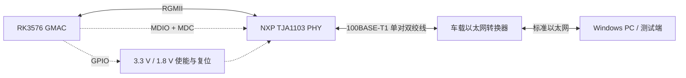

# 以太网 PHY 芯片调试总结

> [!abstract] 一页摘要
> 本文记录 RK3576 平台上 NXP TJA1103 车载以太网 PHY 的适配与调试过程。工作范围涵盖板级配置、设备树、GPIO 电源、复位与接口模式、Clause 45 PHY 识别、链路建立、网络连通性及 UDP 性能验证。

> [!success] 最终结果
> - 内核成功绑定驱动：`NXP C45 TJA1103`。
> - 最终工作 PHY 地址为 `PHYAD 1`，接口为 `end0`。
> - 链路工作在 `100BASE-T1 / Full Duplex`，`Link detected: yes`。
> - Windows 至开发板 `192.168.1.1` Ping：发送 4、接收 4、丢失 0，时延 `<1 ms`。
> - 一次 30 秒 UDP 测试结果：`90.3 Mbit/s`、抖动 `0.131 ms`、丢包 `0/241824 (0%)`。

> [!warning] 仍需补充的信息
> - 开发板的准确型号、硬件版本和原理图版本。
> - SDK manifest、BSP commit、内核配置项及最终设备树完整节点。
> - 正式性能验收标准、测试命令参数、方向、包长和长稳测试时长。
> - 调试截图来自不同时点/板卡：中间扫描曾在地址 `0x03` 读到 ID，最终成功状态为 `PHYAD 1`。复现时应以当前板卡 Strap 和设备树为准。

---

## 阅读导航

| 模块 | 快速入口 | 重点内容 |
| --- | --- | --- |
| 项目说明 | [[#一、背景与目标\|背景与目标]] | 调试对象、职责和验收目标 |
| 系统结构 | [[#二、系统结构与环境\|系统结构与环境]] | RK3576、TJA1103 与测试端的连接关系 |
| 基础知识 | [[#三、关键技术基础\|关键技术基础]] | MDIO Clause 45、RGMII 延时和时钟 |
| 调试方法 | [[#四、总体调试路径\|总体调试路径]] | 推荐排查顺序 |
| 过程记录 | [[#五、调试过程\|调试过程]] | 配置、识别、供电、Link、连通性和性能 |
| 问题闭环 | [[#六、问题与解决方案\|问题与解决方案]] | 典型故障、根因和处理方法 |
| 验证结果 | [[#七、成果与数据\|成果与数据]] | 最终可确认的数据 |
| 经验沉淀 | [[#八、经验与可复用结论\|经验与可复用结论]] | BSP 调试经验和检查清单 |

---

## 一、背景与目标

### 1.1 背景

项目需要在 RK3576 Linux 平台上适配板载车载以太网 PHY。早期按 TJA1120 方向排查，后续通过 Clause 45 PHY ID 和驱动日志确认板载器件实际为 **NXP TJA1103**。因此，调试重点从“驱动是否存在”转向以下几个板级问题：

1. 编译配置与实际开发板是否匹配；
2. PHY 电源、参考时钟、复位及 Strap 状态是否正确；
3. MDIO Clause 45 是否能稳定读取 PHY ID；
4. 设备树的 PHY 地址、接口模式、延时和 GPIO 配置是否正确；
5. 从 Link Up 到二层、三层及性能测试是否完整闭环。

### 1.2 工作范围

| 项目 | 内容 |
| --- | --- |
| 调试对象 | NXP TJA1103 车载以太网 PHY |
| 平台 / SoC | Rockchip RK3576 |
| 角色 | BSP：内核配置、驱动适配、设备树和板级调试 |
| 软件接口 | Linux 网络接口 `end0` |
| 目标 | 正确识别 PHY、建立 100BASE-T1 链路、实现稳定通信并完成性能验证 |

### 1.3 验收目标

- [x] 驱动能够识别并绑定 TJA1103；
- [x] PHY ID 能够通过 MDIO Clause 45 读出；
- [x] `end0` 能够建立 100 Mbps 全双工链路；
- [x] 开发板与 Windows 对端能够 Ping 通；
- [x] 完成短时 UDP 吞吐和丢包测试；
- [ ] 补充准确的软硬件版本基线；
- [ ] 补充长稳、异常恢复和双向性能测试。

---

## 二、系统结构与环境

### 2.1 系统连接关系



> [!note] 两侧接口不要混淆
> `RGMII` 是 RK3576 MAC 与 PHY 之间的数字接口；`100BASE-T1` 是 TJA1103 与车载线束/转换器之间的物理介质接口。

### 2.2 硬件环境

| 项目 | 已确认信息 | 备注 |
| --- | --- | --- |
| SoC | RK3576，集成 GMAC | 具体 GMAC 实例以设备树为准 |
| PHY | NXP TJA1103 | Clause 45 PHY，ID 为 `0x001BB013` |
| 最终 PHY 地址 | `1` | `ethtool` 显示 `PHYAD: 1`；成功日志绑定 `stmmac-0:01` |
| MAC ↔ PHY | RGMII，最终日志为 `phy/rgmii-id` | 延时必须与 MAC/PHY 配置成套核对 |
| 线侧接口 | 100BASE-T1 / 10BASE-T1L 能力，实测 100 Mbps 全双工 | `ethtool end0` |
| 电源 | 3.3 V 与 1.8 V，由 GPIO 使能 | 现有配置使用 `GPIO4_PB2`、`GPIO4_PB1` |
| 复位 | 低有效配置示例 | 实际引脚和时序需按原理图复核 |
| 对端 | 车载以太网转换器 + Windows PC | Windows 地址使用 `192.168.1.2` |
| 开发板地址 | `192.168.1.1/24` | 由测试命令配置 |

### 2.3 软件环境

| 项目 | 信息 |
| --- | --- |
| SDK | RK3576 Linux SDK；准确 manifest / commit 待补充 |
| Kernel | SDK 文档基线为 Linux 6.1；实际构建版本待补充 |
| MAC 驱动 | Rockchip GMAC / DWMAC，日志节点为 `rk_gmac-dwmac` |
| PHY 驱动 | `kernel/drivers/net/phy/nxp-c45-tja11xx.c` |
| 网络接口 | `end0` |
| 主要工具 | `dmesg`、`ethtool`、`ip`、`arping`、sysfs 统计、Ping、iperf3 |
| 烧录方式 | 当前调试建议使用 BSP 正式流程生成完整升级包并整包烧录 |

---

## 三、关键技术基础

### 3.1 MDIO / SMI 与 Clause 45

SMI（Serial Management Interface）通常也称 MDIO 管理接口，由 `MDC` 提供管理时钟、`MDIO` 传输管理数据，供 MAC 读写 PHY 寄存器。

| 协议 | 寻址方式 | 特点 | 本项目用途 |
| --- | --- | --- | --- |
| Clause 22 | 5 位 PHY 地址 + 5 位寄存器地址 | 直接访问 32 个基础寄存器 | 通用 PHY 基础管理 |
| Clause 45 | PHY 端口地址 + MMD/DEVAD + 16 位寄存器地址 | 通过地址帧与数据帧访问扩展寄存器空间 | TJA1103 核心配置与状态读取 |

TJA1103 的主要 MMD 空间：

- `MMD 1`：PMA/PMD；
- `MMD 3`：PCS；
- `MMD 30`：NXP 厂商私有寄存器；
- 其他 MMD 是否可用应以芯片数据手册为准。

扫描日志中的 `ID1=0x001b`、`ID2=0xb013` 组合为 `0x001BB013`，据此确认器件为 TJA1103。

### 3.2 RGMII 延时配置

RGMII 通过 DDR 双边沿采样传输数据。若数据与时钟边沿过于对齐，接收端可能在数据跳变区域采样，出现 CRC 错误、Link Up 但 Ping 不通或高丢包。因此，时钟延时只能由约定的一侧提供，不能遗漏，也不能 MAC 与 PHY 重复叠加。

| `phy-mode` | PHY 内部延时 | MAC 侧原则 |
| --- | --- | --- |
| `rgmii` | TX、RX 均不加 | MAC 或 PCB 必须提供所需延时 |
| `rgmii-id` | TX、RX 均加 | MAC 不再重复增加对应延时 |
| `rgmii-txid` | 仅 PHY TX 方向加 | MAC 仅补另一方向所需延时 |
| `rgmii-rxid` | 仅 PHY RX 方向加 | MAC 仅补另一方向所需延时 |

> [!warning] 配置必须与驱动和芯片能力一致
> 调试中曾出现 `rgmii-id / rgmii-txid / rgmii-rxid modes are not supported` 与 `Cannot attach to PHY (-22)`。最终成功日志显示 `configuring for phy/rgmii-id link mode`。这说明不能只看设备树字符串，需要同时核对驱动版本、PHY 启动模式、复位/Strap 状态和 MAC 延时配置。

### 3.3 时钟、复位与引脚复用

- `clock_in_out = "output"`：由 MAC 向 PHY 输出参考时钟；`input` 表示 MAC 接收外部 PHY 或晶振提供的时钟。
- RGMII 引脚通常是复用引脚，必须在 `pinctrl` 中正确配置。
- `phy-mode`、MAC 延时、PHY 内部延时、参考时钟方向和 `pinctrl` 必须成套调整。
- 复位有效电平或释放时序错误，会造成 PHY 进入错误模式、驱动无法 Attach 或 Link 无法建立。

---

## 四、总体调试路径


> [!tip] 推荐判定顺序
> 先解决“芯片有没有正常上电”，再解决“MDIO 能否读到正确 ID”，然后确认驱动和 Link，最后进入网络协议和性能层。不要在 PHY ID 都不稳定时反复修改 IP、防火墙或性能参数。

---

## 五、调试过程

### 5.1 板级配置、编译与烧录

当前开发板应选择 `rockchip_rk3576_evb1_v10_defconfig`，在 lunch 菜单中对应选项 `4`。曾误选选项 `10`（`rockchip_rk3576s_evb1_v10_defconfig`），导致生成的 `update.img` 与板卡不匹配，烧录后无法启动。

> [!example]- Lunch 配置证据
> ![[Pasted image 20260903142114.png]]

单独替换并烧录未按 BSP 流程正确打包的 `boot.img` 后，启动日志出现：

```text
Failed to load DTB, ret=-19
No valid DTB, ret=-22
No bootable slots found.
FIT: No bootable slots found.
```

处理方式是让板卡重新进入烧录模式，使用与当前板级配置匹配的完整升级包重新烧录。

> [!example]- 启动失败与恢复位置
> ![[Pasted image 20260902172529.png]]
>
> ![[img_v3_02155_0995e649-08f1-4283-ac73-d83500d12a0g.jpg]]

> [!danger] 烧录注意事项
> - 非必要不要清理整个 `output`，避免丢失可追溯的构建产物；
> - 切换 lunch / defconfig 后，应核对当前配置再编译；
> - 在未理清 FIT、DTB、分区和 BSP 打包关系前，不建议把单独生成的 `boot.img` 当作完整升级包使用；
> - 正式调试记录中应补充 manifest、commit、defconfig 和升级包校验值。

### 5.2 设备树关键配置

现有笔记中的复位配置采用内核 5.10+ 常见写法：

```dts
snps,reset-gpio = <&gpio2 RK_PC6 GPIO_ACTIVE_LOW>;
```

相比之下，以下拆分写法属于历史兼容形式，不建议在新配置中继续使用：

```dts
snps,reset-gpio = <&gpio2 RK_PC6 0>;
snps,reset-active-low;
```

电源使能使用 `gpio-hog`：

```dts
&gpio4 {
    soc_sw_3v3_en {
        gpio-hog;
        gpios = <RK_PB2 GPIO_ACTIVE_HIGH>;
        output-high;
        line-name = "SOC_SW_3V3_EN";
    };

    soc_sw_1v8_en {
        gpio-hog;
        gpios = <RK_PB1 GPIO_ACTIVE_HIGH>;
        output-high;
        line-name = "SOC_SW_1V8_EN";
    };
};
```

最终成功日志中的接口模式为：

```text
configuring for phy/rgmii-id link mode
```

> [!todo] 发布前补齐
> 需要从最终工作的 DTS 中粘贴完整 GMAC、MDIO、PHY、`phy-handle`、`reg`、`pinctrl`、时钟与延时配置，避免只有局部 GPIO 片段而无法复现。

### 5.3 PHY 扫描与驱动识别

先检查 Clause 45 扫描日志：

```bash
dmesg | grep C45_SCAN
```

一次有效扫描在地址 `0x03` 读到：

```text
ID1=0x0000001b ID2=0x0000b013
```

组合 PHY ID 为 `0x001BB013`，由此确认芯片是 **TJA1103，而不是 TJA1120**。

> [!example]- Clause 45 扫描证据
> ![[Pasted image 20260903182632.png]]

另一块板/另一阶段曾在地址 `0x01` 读到全零：

```text
addr=0x01 ID1=0x00000000 ID2=0x00000000
```

这不是有效 PHY ID，结合当时现象判断为 PHY 电源或板级电路未正常工作。

> [!example]- 无有效 PHY ID
> ![[Pasted image 20260903202608.png]]

最终成功日志显示：

```text
PHY [stmmac-0:01] driver [NXP C45 TJA1103] (irq=POLL)
configuring for phy/rgmii-id link mode
```

> [!example]- 驱动成功绑定
> ![[Pasted image 20260903220852.png]]

### 5.4 GPIO 电源检查

电源检查不能只看“是否为 0 V”。电压偏低、GPIO 没有拉高、稳压器上游未使能或原理图标注与实板不一致，都可能使 MDIO 只能读到全零/全一或无法访问大部分寄存器。

检查 GPIO 是否已被其他驱动占用：

```bash
cat /sys/kernel/debug/gpio | grep gpio-138
```

推荐步骤：

1. 按 GPIO 编号确认实际引脚及复用关系；
2. 检查 GPIO 是否被占用；
3. 临时拉高/拉低并实测 3.3 V、1.8 V；
4. 电压正常后再固化到设备树 `gpio-hog`；
5. 若电压仍异常，沿原理图向稳压器和上游使能信号继续排查。

### 5.5 复位、模式与驱动 Attach

错误状态下，内核重复打印：

```text
NXP C45 TJA1103 ... rgmii-id, rgmii-txid, rgmii-rxid modes are not supported
rk_gmac-dwmac ... stmmac_open: Cannot attach to PHY (error: -22)
```

> [!example]- 接口模式 / Attach 失败
> ![[Pasted image 20260903214415.png]]

本次排查结论是复位引脚有效电平/释放状态不正确，使 PHY 启动模式与驱动预期不一致。调整复位配置并重新启动后，驱动能够绑定，随后连接车载以太网转换器建立链路。

此外，内核自测配置为：

```text
# CONFIG_STMMAC_SELFTESTS is not set
```

因此当时没有使用 STMMAC 内部回环自测完成闭环，主要通过外部转换器、对端 PC 和网络测试进行验证。

> [!example]- 自测配置状态
> ![[Pasted image 20260903222112.png]]

### 5.6 Link 状态确认

连接车载以太网转换器后，使用以下命令检查链路：

```bash
ethtool end0
cat /sys/class/net/end0/carrier
cat /sys/class/net/end0/operstate
dmesg | grep -iE "link|carrier"
```

关键结果：

```text
Speed: 100Mb/s
Duplex: Full
PHYAD: 1
Auto-negotiation: off
Link detected: yes
```

```text
/sys/class/net/end0/carrier  = 1
/sys/class/net/end0/operstate = up
Link is Up - 100Mbps/Full - flow control off
```

> [!example]- Link Up 证据
> ![[Pasted image 20260904101802.png]]
>
> ![[Pasted image 20260904101856.png]]

> [!note] Link Up 只是第一道门槛
> Link Up 只能证明物理层已建立，不能证明 ARP、IP、Ping 或业务流量正常。仍需继续检查邻居表、收发计数和对端防火墙。

### 5.7 IP 与二层连通性

开发板侧配置：

```bash
ip link set end0 up
ip addr replace 192.168.1.1/24 dev end0

# 查看地址与邻居表
ip -br addr show end0
ip neigh show dev end0
```

若动态 ARP 存在干扰，可在确认对端 MAC 后建立永久邻居项：

```bash
ip neigh replace 192.168.1.2 lladdr a0:ad:9f:51:7b:50 dev end0 nud permanent
```

二层探测：

```bash
arping -I end0 -c 3 192.168.1.2
```

判断逻辑：

- `arping` 不通：优先检查对端 IP、物理转换器、VLAN/接口和 ARP 解析；
- `arping` 通但 Ping 不通：物理层和二层大概率正常，应检查 ICMP、防火墙和路由；
- 邻居表中的目标 MAC 若意外等于本机 MAC，可能造成数据自环，应删除错误邻居项后重新解析；
- 通过收发计数判断数据是否真正经过网卡：

```bash
cat /sys/class/net/end0/statistics/tx_packets
cat /sys/class/net/end0/statistics/rx_packets
```

早期 `ifconfig end0` 显示接口已 `UP/RUNNING`，但 `RX packets: 0`，说明仅看到接口和 Link 状态还不够，仍需对端配置和二层通信验证。

> [!example]- 早期仅发送、未接收状态
> ![[Pasted image 20260904101653.png]]

### 5.8 Ping 与协议层验证

Windows 对端默认防火墙可能拦截 ICMP。若 `arping` 正常而 Ping 失败，可在管理员 CMD 中放行 ICMP Echo：

```bat
netsh advfirewall firewall add rule name="允许Ping" protocol=icmpv4:8,any dir=in action=allow
```

最终 Windows Ping 开发板 `192.168.1.1`：4 个请求全部成功，丢包率 `0%`，显示时延 `<1 ms`。

> [!example]- Windows Ping 结果
> ![[Pasted image 20260904112045.png]]

若需要进一步区分“ICMP 被拦截”与“IP 层完全不通”，可以探测一个确定已监听的 TCP 端口。现有笔记使用了端口 22，但 SSH 未开启时端口关闭并不能证明 IP 层不通，因此正式验证应选择明确开启的服务端口。

### 5.9 UDP 性能测试

截图中的 iperf3 输出包含 `Jitter` 与 `Lost/Total Datagrams`，可确定为 UDP 接收测试。

| 测试 | 时长 | 传输量 | 接收速率 | 抖动 | 丢包 | 说明 |
| --- | ---: | ---: | ---: | ---: | ---: | --- |
| A | 25 s | 270 MBytes | 90.6 Mbit/s | 0.175 ms | 898/203177，0.44% | 地址显示存在 `169.254.x.x` 与 `192.168.1.2` 混用，作为对比数据 |
| B | 30 s | 323 MBytes | 90.3 Mbit/s | 0.131 ms | 0/241824，0% | 对端为 `192.168.1.1 ↔ 192.168.1.2`，作为当前主要结果 |

> [!success] 当前性能结论
> 在 100 Mbps 物理链路下，测试 B 的 UDP 接收速率约 90.3 Mbit/s、0% 丢包，结果接近链路有效载荷上限。由于尚未记录包长、iperf3 完整命令、方向、CPU 负载及验收阈值，当前只能认定为“短时功能与性能初步通过”，不能替代正式长稳验收。

> [!example]- 性能测试证据
> **测试 A：**
> ![[Pasted image 20260904141732.png]]
>
> **测试 B：**
> ![[Pasted image 20260904142121.png]]

---

## 六、问题与解决方案

| ID | 问题现象 | 根因 / 判断 | 解决方法 | 验证方式 | 状态 |
| --- | --- | --- | --- | --- | :---: |
| P-01 | 单独烧 `boot.img` 后板卡无法启动，提示无有效 DTB/启动分区 | `boot.img` 未按当前 BSP/分区方式正确打包，镜像与板级配置不匹配 | 进入烧录模式，使用正确 defconfig 重新构建并整包烧录 | 串口启动日志正常、系统进入 Linux | ✅ |
| P-02 | `update.img` 构建或烧录后持续异常 | lunch 误选选项 10，实际应选选项 4 | 选择 `rockchip_rk3576_evb1_v10_defconfig` 后重新构建 | 启动成功，后续驱动调试可进行 | ✅ |
| P-03 | Clause 45 扫描只读到 `0x00000000`，无有效 PHY ID | PHY 电源未正常起来或板级电源电路异常 | 检查 GPIO 占用并拉高 3.3 V/1.8 V 使能，实测电压，继续向上游电源排查 | 读到有效 ID1/ID2 | ✅/需按板复核 |
| P-04 | `rgmii-* modes are not supported`，`Cannot attach to PHY (-22)` | 复位电平/释放状态使 PHY 启动模式与驱动预期不一致；同时需核对接口模式支持 | 修正复位配置，重新核对 Strap、驱动和 `phy-mode` | 驱动绑定 TJA1103，进入 `phy/rgmii-id` 模式 | ✅ |
| P-05 | Link Up，但初期 RX 为 0 | 对端、地址或邻居解析尚未正确配置 | 配置 `192.168.1.1/24`，检查/固定邻居项，通过 `arping` 验证二层 | RX 计数增长、ARP 成功 | ✅ |
| P-06 | `arping` 正常但 Ping 不通 | Windows 防火墙拦截 ICMP Echo | Windows 管理员 CMD 放行 ICMPv4 Echo | Ping 4/4，0% 丢包 | ✅ |

### 问题闭环的通用写法

> [!tip] 每个问题至少保留六类证据
> **现象 → 复现条件 → 原始日志 → 假设与排除过程 → 根因 → 修复后验证**。只写“改了某配置后好了”无法判断修复是否可复用。

---

## 七、成果与数据

### 7.1 验收结果

| 验收项 | 实际结果 | 证据 | 结论 |
| --- | --- | --- | :---: |
| PHY 型号识别 | ID1 `0x001b` + ID2 `0xb013` → TJA1103 | Clause 45 扫描截图 | ✅ |
| 驱动绑定 | `NXP C45 TJA1103`，`stmmac-0:01` | 内核日志截图 | ✅ |
| Link | 100 Mbps、Full Duplex、PHYAD 1、Carrier 1 | `ethtool`、sysfs、dmesg | ✅ |
| 二层连通 | 可通过 `arping` 获取/验证对端 MAC | 调试记录 | ✅ |
| Ping | Windows → `192.168.1.1`，4/4，0% 丢包，`<1 ms` | Ping 截图 | ✅ |
| UDP 吞吐 | 90.3 Mbit/s，30 s | iperf3 截图 | ✅ 初步通过 |
| UDP 丢包 | 0/241824，0% | iperf3 截图 | ✅ 初步通过 |
| 长稳与异常恢复 | 未形成完整记录 | — | ⏳ 待补充 |

### 7.2 关键数据摘要

> [!success] 可直接用于汇报的数据
> - 完成 RK3576 平台 NXP TJA1103 Clause 45 PHY 的驱动绑定与设备树调试；
> - 建立 100BASE-T1、100 Mbps、全双工链路；
> - Windows 与开发板实现双端 IP 连通，短 Ping 0% 丢包；
> - 30 秒 UDP 接收测试达到 90.3 Mbit/s，抖动 0.131 ms，0% 丢包；
> - 完成烧录配置、电源、复位、PHY ID、Link、ARP/Ping 和性能层面的分层排查闭环。

---

## 八、经验与可复用结论

### 8.1 推荐排查顺序

1. **先核对板卡与固件**：确认 defconfig、DTB、分区表和升级包属于同一硬件版本；
2. **再看电源与复位**：没有稳定供电和正确复位，MDIO 日志不具备分析价值；
3. **用 PHY ID 锁定器件**：不要仅凭原理图标注或预期型号选择驱动；
4. **区分接口两侧**：RGMII 是 MAC 侧接口，100BASE-T1 是线侧接口；
5. **Link Up 后继续分层**：依次检查 ARP、邻居表、收发计数、Ping、TCP/UDP；
6. **性能数据必须带条件**：记录方向、协议、包长、时长、命令、CPU 负载和环境拓扑。

### 8.2 关键经验

> [!tip] BSP 调试经验
> - “驱动源码存在”不等于板级适配完成，PHY 地址、供电、复位、Strap、接口模式和时钟缺一不可；
> - `0xffff/0xffff` 通常表示该地址没有设备或总线悬空，`0x0000/0x0000` 也不是有效 ID，应回到供电/复位/总线层排查；
> - Link Up 但丢包严重时，应重点检查 RGMII TX/RX 延时是否遗漏或叠加；
> - `arping` 是区分二层问题和 ICMP/防火墙问题的高效工具；
> - `/sys/class/net/<if>/statistics` 和 `ethtool -S` 能直接证明报文是否真正发送/接收；
> - 构建与烧录问题应优先核对 lunch/defconfig，避免把网络问题与错误固件混在一起分析。

### 8.3 下一步建议

| 优先级 | 事项 | 完成标准 |
| :---: | --- | --- |
| P0 | 保存最终工作的完整 DTS 和 defconfig | 文档中可直接复现，无关键配置缺失 |
| P0 | 补充 SDK manifest、commit 与构建命令 | 可定位到唯一软件版本 |
| P1 | 固化 iperf3 测试脚本 | 明确 TCP/UDP、方向、包长、时长和目标阈值 |
| P1 | 增加 8 h/24 h 长稳测试 | 记录掉线次数、丢包率、温度和 CPU 负载 |
| P1 | 增加断线重连、复位与掉电恢复测试 | 每种异常均可自动恢复或有明确处理机制 |
| P2 | 整理有效截图并删除重复/错误阶段截图 | 证据与最终配置一一对应 |

---

## 九、调试命令速查

### 9.1 驱动与 PHY

```bash
dmesg | grep C45_SCAN
dmesg | grep -iE "tja|phy|stmmac|gmac"
ethtool -i end0
readlink -f /sys/class/net/end0/phydev
```

### 9.2 GPIO 与链路

```bash
cat /sys/kernel/debug/gpio | grep gpio-138
ethtool end0
cat /sys/class/net/end0/carrier
cat /sys/class/net/end0/operstate
dmesg | grep -iE "link|carrier"
```

### 9.3 地址、邻居与连通性

```bash
ip link set end0 up
ip addr replace 192.168.1.1/24 dev end0
ip -br addr show end0
ip neigh show dev end0
arping -I end0 -c 3 192.168.1.2

ip neigh replace 192.168.1.2 \
  lladdr a0:ad:9f:51:7b:50 \
  dev end0 nud permanent
```

### 9.4 收发统计

```bash
cat /sys/class/net/end0/statistics/tx_packets
cat /sys/class/net/end0/statistics/rx_packets
ethtool -S end0
```

### 9.5 Windows 放行 Ping

```bat
netsh advfirewall firewall add rule name="允许Ping" protocol=icmpv4:8,any dir=in action=allow
```

---

## 十、证据索引

| 编号 | 文件 | 内容 | 对应章节 |
| --- | --- | --- | --- |
| E-01 | `Pasted image 20260903142114.png` | lunch / defconfig 选择 | 5.1 |
| E-02 | `Pasted image 20260902172529.png` | 无有效 DTB / 无启动分区日志 | 5.1 |
| E-03 | `img_v3_02155_0995e649-08f1-4283-ac73-d83500d12a0g.jpg` | 板卡进入恢复烧录的位置 | 5.1 |
| E-04 | `Pasted image 20260903182632.png` | Clause 45 扫描读到 TJA1103 ID | 5.3 |
| E-05 | `Pasted image 20260903202608.png` | 异常板卡读到全零 ID | 5.3 |
| E-06 | `Pasted image 20260903214415.png` | RGMII 模式不支持、Attach 失败 | 5.5 |
| E-07 | `Pasted image 20260903220852.png` | TJA1103 驱动成功绑定 | 5.3 |
| E-08 | `Pasted image 20260904101802.png` | `ethtool`：100 Mbps / Full / Link Yes | 5.6 |
| E-09 | `Pasted image 20260904101856.png` | Carrier、operstate 与 Link Up 日志 | 5.6 |
| E-10 | `Pasted image 20260904112045.png` | Windows Ping 0% 丢包 | 5.8 |
| E-11 | `Pasted image 20260904141732.png` | UDP 测试 A：90.6 Mbit/s、0.44% 丢包 | 5.9 |
| E-12 | `Pasted image 20260904142121.png` | UDP 测试 B：90.3 Mbit/s、0% 丢包 | 5.9 |

---

## 十一、参考资料

- [CVTE KB：以太网PHY芯片调试总结](https://kb.cvte.com/pages/viewpage.action?pageId=564011435)
- [CVTE KB：RK3576 Linux 快速入门](https://kb.cvte.com/pages/viewpage.action?pageId=560865954)
- [[以太网 PHY配置]]
- [[调试问题]]
- RK3576 Linux SDK：`kernel/drivers/net/phy/nxp-c45-tja11xx.c`
- TJA1103 / TJA1120 数据手册及寄存器说明（准确版本待补充）

---

## 文档修订记录

| 日期 | 版本 | 修改人 | 修改内容 |
| --- | --- | --- | --- |
| 2026-09-05 | V0.1 | 黄紫烨 | 创建 KB 初始框架 |
| 2026-09-14 | V0.2 | 黄紫烨 | 合并本地笔记，补充调试过程、证据、问题闭环与测试数据 |
